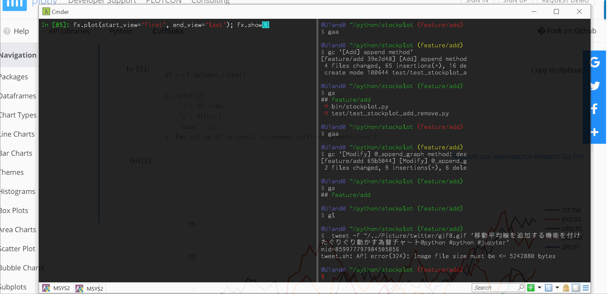

# stockplot.py

```python
import sys
sys.path.append('../../bin/')
```

## 下準備

### モジュールインポート

必要なモジュールをインポートします。


```python
# ----------General Module----------
import numpy as np
import pandas as pd
# ----------User Module----------
from randomwalk import randomwalk
import stockplot as sp
```


```python
# ----------Hide General Module----------
import stockstats
import plotly
```

* General Module, Hide General Moduleは一般に配布されているパッケージなので、condaやpipといったパッケージ管理ソフトなどで追加してください。
    * General ModuleはこのJupyter Notebook内で使います。
    * Hide General Moduleは`stockplot`内で使用します。

```sh
conda install plotly
pip install stockstats
```

* User Moduleのstockplotについては以下にソースコード貼ります。
    * 旧バージョン[Qiita - u1and0 / plotlyでキャンドルチャートプロット](http://qiita.com/u1and0/items/0ebcf097a1d61c636eb9)
* random_walkについては[Qiita - u1and0 / pythonでローソク足(candle chart)の描画](http://qiita.com/u1and0/items/1d9afdb7216c3d2320ef)

### サンプルデータの作成


```python
# Make sample data
np.random.seed(1)
df = randomwalk(60 * 60 * 24 * 90, freq='S', tick=0.01, start=pd.datetime(2017, 3, 20))\
    .resample('T').ohlc() + 115  # 90日分の1分足, 初期値が115
```

ランダムな為替チャートを作成します。
randomwalk関数で**2017/3/20からの1分足を90日分**作成します。

### インスタンス化


```python
# Convert DataFrame as StockPlot
fx = sp.StockPlot(df)
```

StockPlotクラスでインスタンス化します。


## チャートの作成


### 時間足の変更


`fx = sp.StockPlot(sdf)`でインスタンス化されたらまずは時間足を指定します。
変換する際は`resample`メソッドを使います。


```python
fx.resample('D').head()
```


<div>
<table border="1" class="dataframe">
  <thead>
    <tr style="text-align: right;">
      <th></th>
      <th>low</th>
      <th>open</th>
      <th>close</th>
      <th>high</th>
    </tr>
  </thead>
  <tbody>
    <tr>
      <th>2017-03-20</th>
      <td>112.71</td>
      <td>115.00</td>
      <td>114.22</td>
      <td>116.80</td>
    </tr>
    <tr>
      <th>2017-03-21</th>
      <td>113.67</td>
      <td>114.23</td>
      <td>115.52</td>
      <td>116.23</td>
    </tr>
    <tr>
      <th>2017-03-22</th>
      <td>112.23</td>
      <td>115.51</td>
      <td>112.29</td>
      <td>117.44</td>
    </tr>
    <tr>
      <th>2017-03-23</th>
      <td>111.88</td>
      <td>112.28</td>
      <td>116.02</td>
      <td>116.08</td>
    </tr>
    <tr>
      <th>2017-03-24</th>
      <td>114.76</td>
      <td>116.03</td>
      <td>118.60</td>
      <td>119.10</td>
    </tr>
  </tbody>
</table>
</div>


1分足として入力したデータを日足に変換したデータが返されました。
変換されたデータは`stock_dataframe`というインスタンス変数に格納されます。


```python
fx.stock_dataframe.head(), fx.stock_dataframe.tail()
```


    (               low    open   close    high
     2017-03-20  112.71  115.00  114.22  116.80
     2017-03-21  113.67  114.23  115.52  116.23
     2017-03-22  112.23  115.51  112.29  117.44
     2017-03-23  111.88  112.28  116.02  116.08
     2017-03-24  114.76  116.03  118.60  119.10,
                    low    open   close    high
     2017-06-13  103.18  106.19  106.12  106.28
     2017-06-14  104.59  106.13  108.07  108.51
     2017-06-15  103.97  108.06  105.66  108.86
     2017-06-16  104.94  105.66  108.25  108.59
     2017-06-17  107.31  108.24  109.22  110.73)


2017/3/20-2017/6/17の日足ができたことを確認しました。


resampleメソッドは`'open', 'high', 'low', 'close'`のカラムを持ったデータフレーム(OHLC)の時間足変換を行います。

```python
def resample(self, freq: str):
    """Convert ohlc time span

    Usage: `fx.resample('D')  # 日足に変換`

    * Args:  変更したい期間 M(onth) | W(eek) | D(ay) | H(our) | T(Minute) | S(econd)
    * Return: スパン変更後のデータフレーム
    """
    self.freq = freq
    df = self._init_stock_dataframe.resample(freq).ohlc2().dropna()
    self.stock_dataframe = ss.StockDataFrame(df)
    for indicator in self._indicators.keys():
        self.append(indicator)  # Re-append indicator in dataframe
    return self.stock_dataframe
```


OHLCの時間足を変えたいとき、`fx.resample('D').ohlc()`とやりがちですが、`open high low close`それぞれに対して`open high low close`を分けようとするため思ったように変換してくれません。

```python
df.resample('D').ohlc()  # やりがちなohlcデータを再度resampleしてohlcで集計

           open                high                 low                close  \
           open high low close open high low close open high low close  open   
2017-11-25    1   13   1    13    2   13   2    13    1   12   1    12     2   
2017-11-26   12   15  10    13   14   16  10    13   12   14   9    13    14   
2017-11-27   12   15   7    15   12   16   9    15   10   15   7    14    10   

           high low close  
2017-11-25   10   0     8  
2017-11-26   15   6     9  
2017-11-27   14   6     8  
2017-11-28    6 -10    -9  
2017-11-29   -6 -17    -9  

                                   ...
```

そこで、OHLC->OHLCの変換をメソッドでできるように[`ohlc2()`メソッドを作成](https://qiita.com/u1and0/items/8e7bcaaf3668ed2afee1)しました。

```python
from pandas.core import resample

def ohlc2(self):
    """`pd.DataFrame.resample(<TimeFrame>).ohlc2()`
    Resample method converting OHLC to OHLC
    """
    agdict = {'open': 'first',
              'high': 'max',
              'low': 'min',
              'close': 'last'}
    columns = list(agdict.keys())
    if all(i in columns for i in self.columns):
        pass
    elif all(i in columns + ['volume'] for i in self.columns):
        agdict['volume'] = 'sum'
    else:
        raise KeyError("columns must have ['open', 'high', 'low', 'close'(, 'volume')]")
    return self.agg(agdict)


# Add instance as `pd.DataFrame.resample('<TimeFrame>').ohlc2()`
resample.DatetimeIndexResampler.ohlc2 = ohlc2


# 使い方

df

                     open  high  low  close
2017-11-25 00:00:00     1     2    1      2
2017-11-25 01:00:00     1     3    1      3
2017-11-25 02:00:00     4     5    4      5
2017-11-25 03:00:00     6     8    6      7
2017-11-25 04:00:00     7     8    7      7
                 ...
# ↑これが


df.resample('D').ohlc2()

# ↓こう
            open  high  low  close
2017-11-25     1    13    1     12
2017-11-26    12    16    9     13
2017-11-27    12    16    7     14
2017-11-28    13    14    3     10
2017-11-29    11    21   11     12
                 ...
```


`freq`は`df.resample`で使える時間であれば自由なので、例えばfreq="1D4H2T24S"とすると"1日と4時間2分24秒足"といった変な時間足を作れます。


```python
fx.resample('1D4H2T24S').head()
```


<div>
<table border="1" class="dataframe">
  <thead>
    <tr style="text-align: right;">
      <th></th>
      <th>low</th>
      <th>open</th>
      <th>close</th>
      <th>high</th>
    </tr>
  </thead>
  <tbody>
    <tr>
      <th>2017-03-20 00:00:00</th>
      <td>112.71</td>
      <td>115.00</td>
      <td>114.28</td>
      <td>116.80</td>
    </tr>
    <tr>
      <th>2017-03-21 04:02:24</th>
      <td>113.67</td>
      <td>114.28</td>
      <td>116.92</td>
      <td>117.44</td>
    </tr>
    <tr>
      <th>2017-03-22 08:04:48</th>
      <td>111.93</td>
      <td>116.91</td>
      <td>112.38</td>
      <td>117.26</td>
    </tr>
    <tr>
      <th>2017-03-23 12:07:12</th>
      <td>111.88</td>
      <td>112.38</td>
      <td>117.79</td>
      <td>118.01</td>
    </tr>
    <tr>
      <th>2017-03-24 16:09:36</th>
      <td>116.71</td>
      <td>117.80</td>
      <td>120.74</td>
      <td>121.27</td>
    </tr>
  </tbody>
</table>
</div>


### ローソク足の描画

時間足の変換が済むと、プロットが可能です。
プロットするときは`plot`メソッドを使います。


```python
fx.plot()
```

`fx.plot()`で`plotly`で出力する形式`plotly.graph_objs.graph_objs.Figure`(`data`と`layout`がキーとなった辞書)が返されます。


```python
def plot(self, how='candle', start_view=None, end_view=None, periods_view=None, shift=None,
             start_plot=None, end_plot=None, periods_plot=None,
             showgrid=True, validate=False, **kwargs):
        """Retrun plotly candle chart graph

        Usage: `fx.plot()`

        * Args:
            * how: 'candle', 'c' -> candle_plot / 'heikin', 'h' -> heikin_ahi plot
            * start, end: 最初と最後のdatetime, 'first'でindexの最初、'last'でindexの最後
            * periods: 足の本数
            > **start, end, periods合わせて2つの引数が必要**
            * shift: shiftの本数の足だけ右側に空白
        * Return: グラフデータとレイアウト(plotly.graph_objs.graph_objs.Figure)
        """
        # ---------Set "plot_dataframe"----------
        # Default Args
        if com._count_not_none(start_plot,
                               end_plot, periods_plot) == 0:
            end_plot = 'last'
            periods_plot = 300
        try:
            # first/last
            start_plot = self.stock_dataframe.index[0] if start_plot == 'first' else start_plot
            end_plot = self.stock_dataframe.index[-1] if end_plot == 'last' else end_plot
        except AttributeError:
            raise AttributeError('{} Use `fx.resample(<TimeFrame>)` at first'
                                 .format(type(self.stock_dataframe)))
        # Set "plot_dataframe"
        start_plot, end_plot = set_span(start_plot, end_plot, periods_plot, self.freq)
        if how in ('candle', 'c'):
            plot_dataframe = self.stock_dataframe.loc[start_plot:end_plot]
            self._fig = FF.create_candlestick(plot_dataframe.open,
                                              plot_dataframe.high,
                                              plot_dataframe.low,
                                              plot_dataframe.close,
                                              dates=plot_dataframe.index)
        elif how in ('heikin', 'h'):
            self.stock_dataframe.heikin_ashi()
            plot_dataframe = self.stock_dataframe.loc[start_plot:end_plot]
            self._fig = FF.create_candlestick(plot_dataframe.hopen,
                                              plot_dataframe.hhigh,
                                              plot_dataframe.hlow,
                                              plot_dataframe.hclose,
                                              dates=plot_dataframe.index)
        else:
            raise KeyError('Use how = "[c]andle" or "[h]eikin"')
        # ---------Append indicators----------
        for indicator in self._indicators.keys():
            self._append_graph(indicator, start_plot, end_plot)  # Re-append indicator in graph
        # ---------Set "view"----------
        # Default Args
        if com._count_not_none(start_view,
                               end_view, periods_view) == 0:
            end_view = 'last'
            periods_view = 50
        # first/last
        start_view = plot_dataframe.index[0] if start_view == 'first' else start_view
        end_view = plot_dataframe.index[-1] if end_view == 'last' else end_view
        # Set "view"
        start_view, end_view = set_span(start_view, end_view, periods_view, self.freq)
        end_view = set_span(start=end_view, periods=shift,
                            freq=self.freq)[-1] if shift else end_view
        view = list(to_unix_time(start_view, end_view))
        # ---------Plot graph----------
        self._fig['layout'].update(xaxis={'showgrid': showgrid, 'range': view},
                                   yaxis={"autorange": True})
        return self._fig
```

### チャートの表示

チャートを見るには`matplotlib.pyplot`のように`show`メソッドを使います。
`show`メソッドの第一引数`how`のデフォルト引数は`html`です。
引数なしで`show`するとブラウザの新しいタブが立ち上がってそこに表示されます。
今はJupyter Notebook上で描きたいので、`how=jupyter`、または単に`jupyter`を引数にします。

```python
def show(self, how='html', filebasename='candlestick_and_trace'):
    """Export file type"""
    if how == 'html':
        ax = pyo.plot(self._fig, filename=filebasename + '.html',
                      validate=False)  # for HTML
    elif how == 'jupyter':
        ax = pyo.iplot(self._fig, filename=filebasename + '.html',
                       validate=False)  # for Jupyter Notebook
    elif how in ('png', 'jpeg', 'webp', 'svg'):
        ax = pyo.plot(self._fig, image=how, image_filename=filebasename,
                      validate=False)  # for file exporting
    else:
        raise KeyError(how)
    return ax
```


```python
fx.show(how='jupyter')
```


2017/3/20-2017/6/17の日足が描かれました。

plotlyの操作は

* グラフ上のマウスオーバーで値の表示
* グラフ上のドラッグでズームイン
* 軸上(真ん中)のドラッグでスクロール
* 軸上(端)のドラッグでズームアウト
* ダブルクリックで元のビューに戻る
* トリプルクリックで全体表示


### 再度時間足の変更

日足だけじゃなくて別の時間足も見たいです。

そういうときは再度`resample`メソッドを使って時間幅を変更します。


```python
fx.resample('H')  # 1時間足に変更
fx.plot()  # ローソク足プロット
fx.show('jupyter')  # プロットの表示をJupyter Notebookで開く
```


1時間足がプロットされました。
あえて時間をかけてマウスオーバーしているのですが、1時間ごとにプロットされていることがわかりましたでしょうか。

ここで再度`stock_dataframe`を確認してみますと、1時間足に変わっていることがわかります。


```python
fx.stock_dataframe.head(), fx.stock_dataframe.tail()
```


    (                        low    open   close    high
     2017-03-20 00:00:00  114.76  115.00  115.26  115.49
     2017-03-20 01:00:00  115.27  115.27  116.11  116.47
     2017-03-20 02:00:00  115.69  116.10  115.69  116.53
     2017-03-20 03:00:00  115.62  115.68  116.02  116.19
     2017-03-20 04:00:00  115.74  116.01  116.00  116.31,
                             low    open   close    high
     2017-06-17 19:00:00  108.50  108.65  109.91  109.93
     2017-06-17 20:00:00  109.56  109.90  109.76  110.03
     2017-06-17 21:00:00  109.47  109.76  109.77  110.06
     2017-06-17 22:00:00  109.27  109.77  109.31  110.10
     2017-06-17 23:00:00  108.96  109.30  109.22  109.70)


### 平均足の描画

[平均足の計算](http://www.craigmasonforcongress.com/keisan.html)は以下のとおりです。


```
始値　＝　（一本前の始値（平均足）　＋　一本前の終値（平均足））÷２
高値　＝　高値（ローソク足）
安値　＝　安値（ローソク足）
終値　＝　（始値（ローソク足）　＋　高値（ローソク足）　＋　安値（ローソク足）　＋　終値（ローソク足） ）÷４ 
```

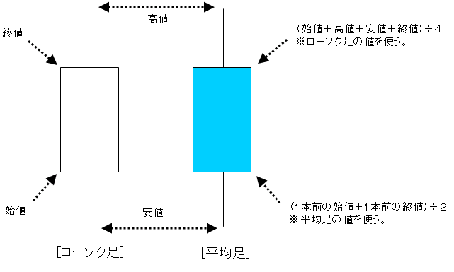


pythonで書くと次のようになります。

```python
def heikin_ashi(self):
    """Return HEIKIN ASHI columns"""
    self['hopen'] = (self.open.shift() + self.close.shift()) / 2
    self['hclose'] = (self[['open', 'high', 'low', 'close']]).mean(1)
    self['hhigh'] = self[['high', 'hopen', 'hclose']].max(1)
    self['hlow'] = self[['low', 'hopen', 'hclose']].min(1)
    return self[['hopen', 'hhigh', 'hlow', 'hclose']]


pd.DataFrame.heikin_ashi = heikin_ashi
```

`plot`メソッドで描画方法を`heikin`(または`h`)と指定するとデフォルトのローソク足(`candle`)から平均足の描画に切り替わります。

```python
fx.plot('h')
fx.show(how='png', filebasename = 'heikin')
```
USDJPY 2017年1月 時間足
平均足
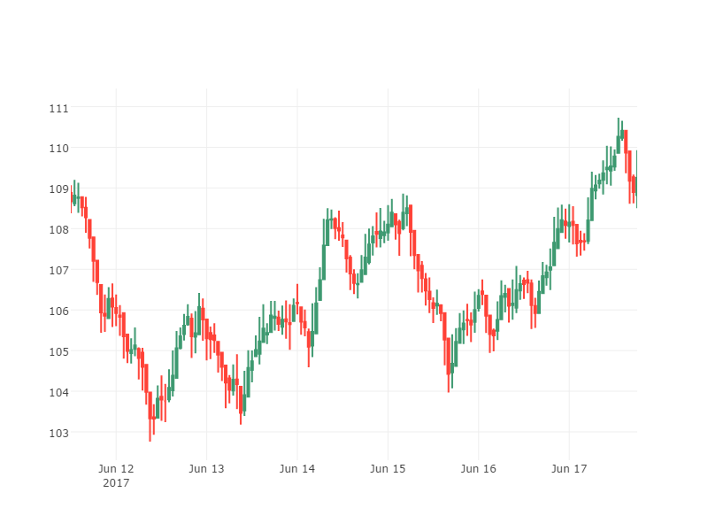

同通貨同期間
ローソク足


## 描画の範囲

### plot範囲の指定

`plot`メソッドは`stock_dataframe`の中身を**すべてグラフ化しません**。
デフォルトの場合、**最後の足から数えて300本足**がグラフ化されます。

例として、5分足のチャートを描きます。


```python
fx.resample('5T')  # 5分足に変換
fx.plot()
fx.show('jupyter')
```


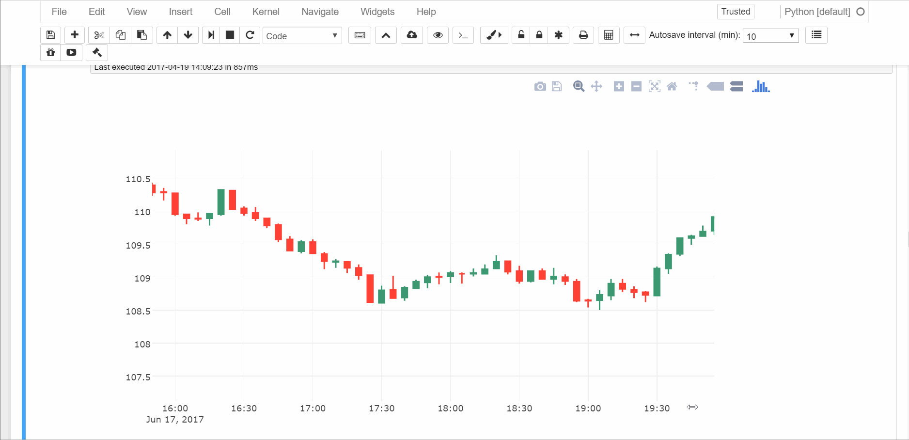


```python
# stock_dataframeは2017/3/20から
fx.stock_dataframe.index
```


    DatetimeIndex(['2017-03-20 00:00:00', '2017-03-20 00:05:00',
                   '2017-03-20 00:10:00', '2017-03-20 00:15:00',
                   '2017-03-20 00:20:00', '2017-03-20 00:25:00',
                   '2017-03-20 00:30:00', '2017-03-20 00:35:00',
                   '2017-03-20 00:40:00', '2017-03-20 00:45:00',
                   ...
                   '2017-06-17 23:10:00', '2017-06-17 23:15:00',
                   '2017-06-17 23:20:00', '2017-06-17 23:25:00',
                   '2017-06-17 23:30:00', '2017-06-17 23:35:00',
                   '2017-06-17 23:40:00', '2017-06-17 23:45:00',
                   '2017-06-17 23:50:00', '2017-06-17 23:55:00'],
                  dtype='datetime64[ns]', length=25920, freq='5T')


2017/3/20-2017/6/17ののデータフレームを5分足に変換してローソク足を描きました。
最初の足が2017/3/20ではなく2017/6/16で途切れています。
これはグラフ化される範囲が5分足の300本足で切られているためです。

描画されるデータが大きいと`show`メソッド時に大変リソースを食います。
**グラフとして見る範囲は限定的だろうとの考えから、`plot`メソッドは`stock_dataframe`から一部切り出した形をグラフ化(plot)します。**

グラフ化する範囲は、`plot`メソッドの引数として与えることができます。

* `plot`メソッドのプロット範囲を決める引数
    * `start_plot`: グラフ化する最初の日付・時間
    * `end_plot`: グラフ化する最後の日付・時間
    * `periods_plot`: グラフ化する足の数(int型)
* start, end, periodsのうち二つが指定されている必要がある。
* 何も指定しなければ、デフォルト値が入力される。

```python
# Default Args
if com._count_not_none(start_plot,
                       end_plot, periods_plot) == 0:  # すべてNoneのままだったら
    end_plot = 'last'  # 最後の足から
    periods_plot = 300  # 300本足で切る
# first/last
start_plot = self.stock_dataframe.index[0] if start_plot == 'first' else start_plot
end_plot = self.stock_dataframe.index[-1] if end_plot == 'last' else end_plot  # 'last'=最後の足とはindexの最後
```

`start_plot, end_plot`を指定して描画してみます。


```python
# fx.resample('5T')  # 既に5分足に変換されているので必要ない
start = pd.datetime(2017,6,17,9,0,0)     # 2017/6/17 09:00
end = pd.datetime(2017,6,17,23,0,0)      # 2017/6/17 23:00 
fx.plot(start_plot=start, end_plot=end)  # 2017/6/17 09:00-23:00までをプロットする
fx.show('jupyter')
```


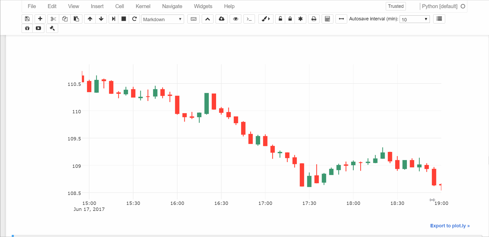

2017/6/17 09:00 - 2017/6/17 23:00の5分足が描かれました。

### view範囲の指定

plotlyのズームイン / アウト、スクロールを使えば表示範囲外のところも見れます。
しかし、見たい期間が最初から決まっているのにもかかわらず、グラフ化してからスクロールするのはメンドウです。

そこで、`plot`メソッドではグラフ化して最初に見えるビュー範囲(view)を指定できます。

例えば2017/5/8から2017/6/5の4時間足が見たいとしましょう。


```python
fx.resample('4H')  # 4時間足に変換
start = pd.datetime(2017,5,8)   # 2017/5/8
end = pd.Timestamp('20170605')  # 2017/6/5(Timestampでも指定可能)
fx.plot(start_view=start, end_view=end) # 2017/5/8 - 2017/6/5を表示する
fx.show('jupyter')
```


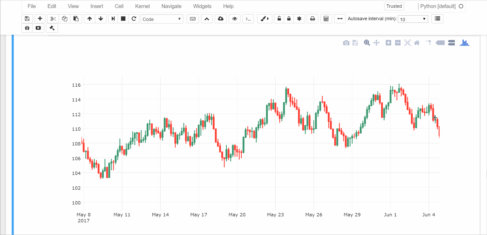

次は`start_view, end_view`の指定ではなく、`end_view, periods_view`を使って表示してみます。


```python
fx.resample('D')  # 日足に変換
fx.plot(periods_view=20, end_view='last')
    # `end_view`を'last'　最後の足に設定する
    # `periods_view`で20本足表示する
fx.show('html')  # html形式で表示
```


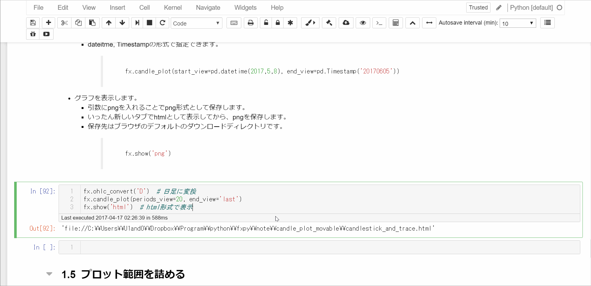

* `plot`メソッドのビュー範囲を決める引数
    * `start_view`: 表示する最初の日付・時間
    * `end_view`: 表示する最後の日付・時間
    * `periods_view`: 表示する足の数(int型)
* start, end, periodsのうち二つが指定されている必要がある。
* 何も指定しなければ、デフォルト値が入力される。

```python
# Default Args
if com._count_not_none(start_view,
                       end_view, periods_view) == 0:  # すべてNoneのままだったら
    end_view = 'last'  # 最後の足から
    periods_view = 50  # 50本足までを表示する
# first/last
start_view = plot_dataframe.index[0] if start_view == 'first' else start_view
end_view = plot_dataframe.index[-1] if end_view == 'last' else end_view  # 'last'はindexの最後
```

`periods`の指定は`end`が指定された場合は`start`、`start`が指定された場合は`end`を計算します。
計算する関数は次のようにしました。

```python
from pandas.core import common as com
def set_span(start=None, end=None, periods=None, freq='D'):
    """ 引数のstart, end, periodsに対して
    startとendの時間を返す。

    * start, end, periods合わせて2つの引数が指定されていなければエラー
    * start, endが指定されていたらそのまま返す
    * start, periodsが指定されていたら、endを計算する
    * end, periodsが指定されていたら、startを計算する
    """
    if com._count_not_none(start, end, periods) != 2:  # 引数が2個以外であればエラー
        raise ValueError('Must specify two of start, end, or periods')
    # `start`が指定されていれば`start`をそのまま返し、そうでなければ`end`から`periods`引いた時間を`start`とする。
    start = start if start else (pd.Period(end, freq) - periods).start_time
    # `end`が指定されていれば`end`をそのまま返し、そうでなければ`start`から`periods`足した時間を`end`とする。
    end = end if end else (pd.Period(start, freq) + periods).start_time
    return start, end
```

呼び出すときは次のようにします。
```python
start_view, end_view = set_span(start_view, end_view, periods_view, self.freq)
```
> 説明は省きましたが、グラフ化する時間足も`view`と同様に`periods_plot`引数として指定できます。

`view`は`self._fig`の`layout`において、xaxisの範囲(range)を変更するのに使います。

変更する際、unix時間に変換する必要があるので、`to_unix_time`関数に通します。

```python
def to_unix_time(*dt: pd.datetime)->iter:
    """datetimeをunix秒に変換
    引数: datetime(複数指定可能)
    戻り値: unix秒に直されたイテレータ"""
    epoch = pd.datetime.utcfromtimestamp(0)
    return ((i - epoch).total_seconds() * 1000 for i in dt)
```


```python
view = list(to_unix_time(start_view, end_view))
# ---------Plot graph----------
self._fig['layout'].update(xaxis={'showgrid': showgrid, 'range': view},
                           yaxis={"autorange": True})
```

### 右側に空白を作る

引数`shift`に指定した足の本数だけ、右側に空白を作ります。
> 時間足が短いとうまくいきません。原因究明中です。
> 想定より多めに足の数を設定することでとりあえず回避しています。

予測線を引いたり一目均衡表を使うとき必要になる機能だと思います。


```python
fx.plot()
fx.show('jupyter')
```


```python
fx.plot(shift=30)
fx.show('jupyter')
```


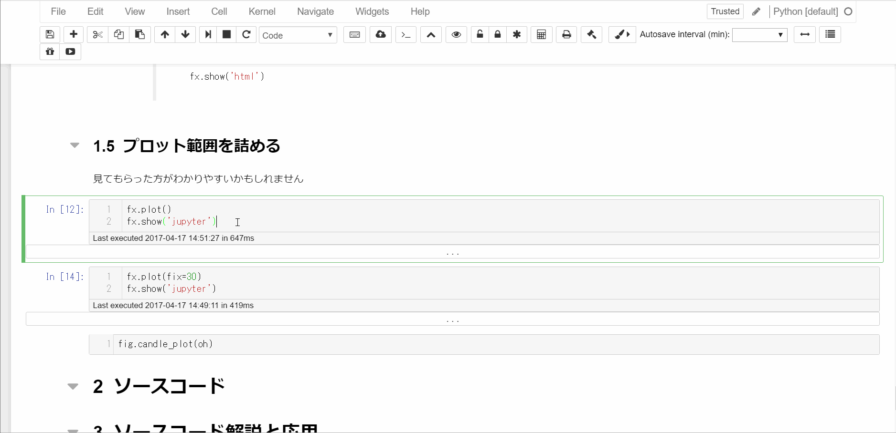

`plot`メソッドの`fix`引数を30とし、30本の足だけの空白を右側(時間の遅い側)に作ることができました。
処理としては、先ほど出てきた`set_span`関数を使って、`end_view`に30本足分の時間足を足してあげます。

```python
end_view = set_span(start=end_view, periods=shift,
                    freq=self.freq)[-1] if shift else end_view
```

### data範囲、plot範囲, view範囲、shiftまとめ

図示すると以下のような感じです。

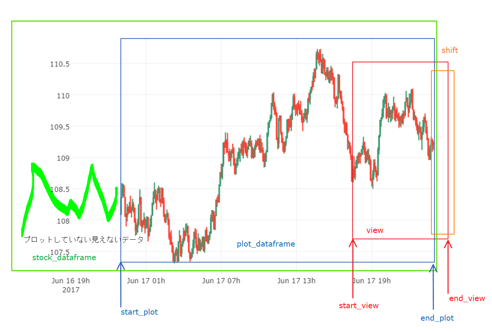

## まとめ

### メソッド一覧

* `__init__`
    * pandas.Dataframeをインスタンス化
    * open, high, low, closeのカラムを持たないとエラー
    * indexがDatetimeIndexでなければエラー
* `resample`メソッド
    * `freq`引数で時間足を決める。
    * `stock_dataframe`を決める。
* `plot`メソッド
    * plot範囲(`plot_dataframe`)を決める。
        * `start_plot`
        * `end_plot`
        * `periods_plot`
    * view範囲を決める。
        * `start_view`
        * `end_view`
        * `periods_view`
    * グラフの右側の空白(shift)を決める。
        * `shift`
* `show`メソッド
    * 出力形式を決める。
        * `how='jupyter', 'html', 'png', 'jpeg', 'webp', 'svg'`
    * ファイル名を決める。
        * `filebasename`

### 使用メソッドフローチャート
各メソッドの呼び出しに使う引数と戻り値、プロットに使うフローは以下の図の通りです。

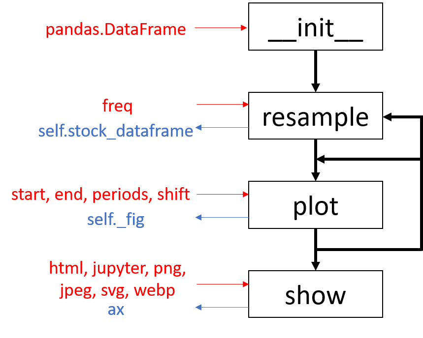

---


## 指標の操作


### 指標の追加

指標をプロットしてみます。
最もポピュラーな単純移動平均(Simple Moving Average)をプロットします。
追加するには`append`メソッドを使います。


```python
fx.append('close_25_sma')
fx.stock_dataframe.head()
```


<div>
<table border="1" class="dataframe">
  <thead>
    <tr style="text-align: right;">
      <th></th>
      <th>high</th>
      <th>low</th>
      <th>open</th>
      <th>close</th>
      <th>close_25_sma</th>
    </tr>
  </thead>
  <tbody>
    <tr>
      <th>2017-03-20 00:00:00</th>
      <td>115.98</td>
      <td>114.79</td>
      <td>115.00</td>
      <td>115.34</td>
      <td>115.340000</td>
    </tr>
    <tr>
      <th>2017-03-20 04:00:00</th>
      <td>116.48</td>
      <td>115.16</td>
      <td>115.34</td>
      <td>116.03</td>
      <td>115.685000</td>
    </tr>
    <tr>
      <th>2017-03-20 08:00:00</th>
      <td>116.75</td>
      <td>115.76</td>
      <td>116.03</td>
      <td>116.31</td>
      <td>115.893333</td>
    </tr>
    <tr>
      <th>2017-03-20 12:00:00</th>
      <td>116.87</td>
      <td>115.62</td>
      <td>116.32</td>
      <td>115.92</td>
      <td>115.900000</td>
    </tr>
    <tr>
      <th>2017-03-20 16:00:00</th>
      <td>116.12</td>
      <td>113.85</td>
      <td>115.92</td>
      <td>114.36</td>
      <td>115.592000</td>
    </tr>
  </tbody>
</table>
</div>


```python
fx.plot(start_view='first', end_view='last')
fx.show('png', filebasename='png2')
```


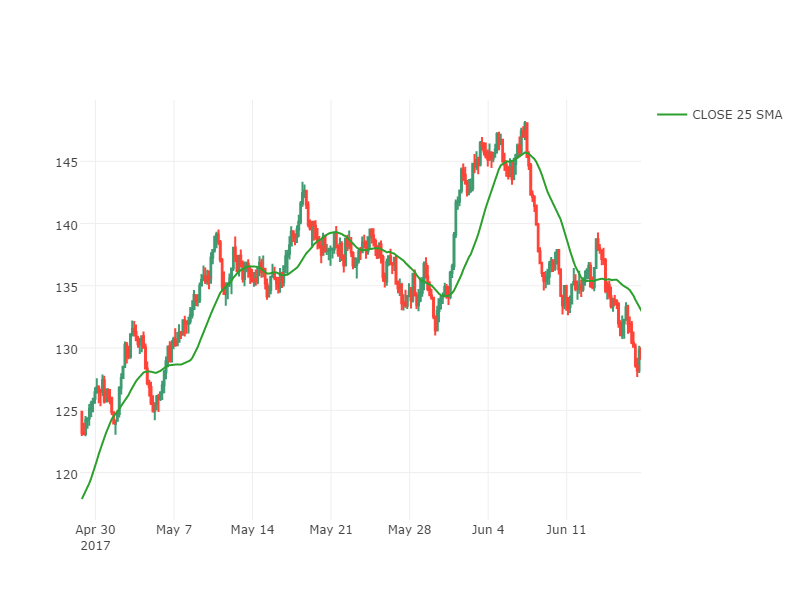

close_25_sma(25本足単純移動平均線)が追加されました。
なお、`append`メソッド単体をJupyter NotebookやIpython上で実行するとclose_25_smaの値が戻り値として表示されます。

追加された指標は時間足を変えても、その時間足に合わせて値を変更してくれます。


```python
fx.resample('15T')
fx.plot(start_view='first', end_view='last')
fx.show('png', filebasename='png3')
```


`resample`メソッドで15分足に変えた後、`append`メソッドを使わなくとも`close_25_sma`が追加されたままです。

これは`append`メソッドを実行した際ではなく、`plot`メソッドを実行した際にグラフに指標を追加するようにしたためです。

`append`メソッドが行うのは`self._indicators`に値を格納するだけです。

```python
# ========self._indicatorに指標を蓄える==========
    def append(self, indicator):
        indicator_value = self.stock_dataframe[indicator]
        self._indicators[indicator] = indicator_value  # self._indicatorsに辞書形式で
        return indicator_value
```

```python
# =======plotメソッド実行時にself._indicatorに蓄えられている指標を_append_graphに渡す==========
    def plot(self, (略)):
        # (中略)
        # ---------Append indicators----------
        for indicator in self._indicators.keys():
            self._append_graph(indicator, start_plot, end_plot)  # Re-append indicator in graph
        # (中略)
        return self._fig

# =======self._indicatorに蓄えられている指標をself._figのデータ部分に追加する==========
    def _append_graph(self, indicator, start, end):
        graph_value = self._indicators[indicator].loc[start:end]
        plotter = go.Scatter(x=graph_value.index, y=graph_value,
                             name=indicator.upper().replace('_', ' '))  # グラフに追加する形式変換
        self._fig['data'].append(plotter)
```

### 指標の削除

指標の削除には`pop`メソッドを使用します。


```python
fx.pop('close_25_sma')
fx.stock_dataframe.head()
```


<div>
<table border="1" class="dataframe">
  <thead>
    <tr style="text-align: right;">
      <th></th>
      <th>open</th>
      <th>high</th>
      <th>low</th>
      <th>close</th>
    </tr>
  </thead>
  <tbody>
    <tr>
      <th>2017-03-20 00:00:00</th>
      <td>115.00</td>
      <td>115.98</td>
      <td>114.79</td>
      <td>115.34</td>
    </tr>
    <tr>
      <th>2017-03-20 04:00:00</th>
      <td>115.34</td>
      <td>116.48</td>
      <td>115.16</td>
      <td>116.03</td>
    </tr>
    <tr>
      <th>2017-03-20 08:00:00</th>
      <td>116.03</td>
      <td>116.75</td>
      <td>115.76</td>
      <td>116.31</td>
    </tr>
    <tr>
      <th>2017-03-20 12:00:00</th>
      <td>116.32</td>
      <td>116.87</td>
      <td>115.62</td>
      <td>115.92</td>
    </tr>
    <tr>
      <th>2017-03-20 16:00:00</th>
      <td>115.92</td>
      <td>116.12</td>
      <td>113.85</td>
      <td>114.36</td>
    </tr>
  </tbody>
</table>
</div>


```python
fx.plot(start_view='first', end_view='last')
fx.show('png', filebasename='png3_1')
```


close_25_smaが削除されました。

単純移動平均以外の指標も描いてみます。


```python
fx.append('close_20_ema')  # 終値の指数移動平均線
fx.append('boll')  # ボリンジャーバンド真ん中(close_20_smaと同じ)
fx.append('boll_ub')  # ボリンジャーバンド上
fx.append('boll_lb')  # ボリンジャーバンド下
fx.append('high_0~20_max')  # 20足前の移動最高値
fx.append('low_0~20_min')  # 20足前の移動最安値
fx.plot(start_view='first', end_view='last')
fx.show('png', filebasename='png4')
```


 * 20本足ボリンジャーバンド
 * 20本足移動最高値
 * 20本足最安値
 
 がプロットされました。

追加した指標名がわからなくなったらインスタンス変数からアクセスできます。


```python
fx._indicators.keys()
```


    dict_keys(['low_0~20_min', 'boll', 'high_0~20_max', 'boll_ub', 'close_20_ema', 'boll_lb'])


`append`メソッドを使ったときの引数がkey、戻り値がvalueとして、`_indicators`にディクショナリ形式で保存されます。
そのため、`keys`メソッドで追加した指標名を呼び出すことができます。
> `fx.stock_dataframe.columns`でも表示できますが、推奨できません。
> `stockstats.StockDataFrame`は指標の生成時に補助的なカラムも発生させます。
> そのため、補助指標(グラフにプロットされていないデータ)も混在していて、どれがプロットされているのか見分けづらいためです。


```python
fx.stock_dataframe.columns
```


    Index(['open', 'high', 'low', 'close', 'close_20_ema', 'close_20_sma',
           'close_20_mstd', 'boll', 'boll_ub', 'boll_lb', 'high_0_s', 'high_1_s',
           'high_2_s', 'high_3_s', 'high_4_s', 'high_5_s', 'high_6_s', 'high_7_s',
           'high_8_s', 'high_9_s', 'high_10_s', 'high_11_s', 'high_12_s',
           'high_13_s', 'high_14_s', 'high_15_s', 'high_16_s', 'high_17_s',
           'high_18_s', 'high_19_s', 'high_20_s', 'high_0~20_max', 'low_0_s',
           'low_1_s', 'low_2_s', 'low_3_s', 'low_4_s', 'low_5_s', 'low_6_s',
           'low_7_s', 'low_8_s', 'low_9_s', 'low_10_s', 'low_11_s', 'low_12_s',
           'low_13_s', 'low_14_s', 'low_15_s', 'low_16_s', 'low_17_s', 'low_18_s',
           'low_19_s', 'low_20_s', 'low_0~20_min'],
          dtype='object')


`fx.stock_dataframe.columns`による指標の表示は、追加していない指標名も表示されます。

ごちゃごちゃしてきたので`high_20_max`, `low_20_min`を削除します。


```python
fx.pop('high_0~20_max')
fx.pop('low_0~20_min')
fx.plot(start_view='first', end_view='last')
fx.show('png', filebasename='png5')
```


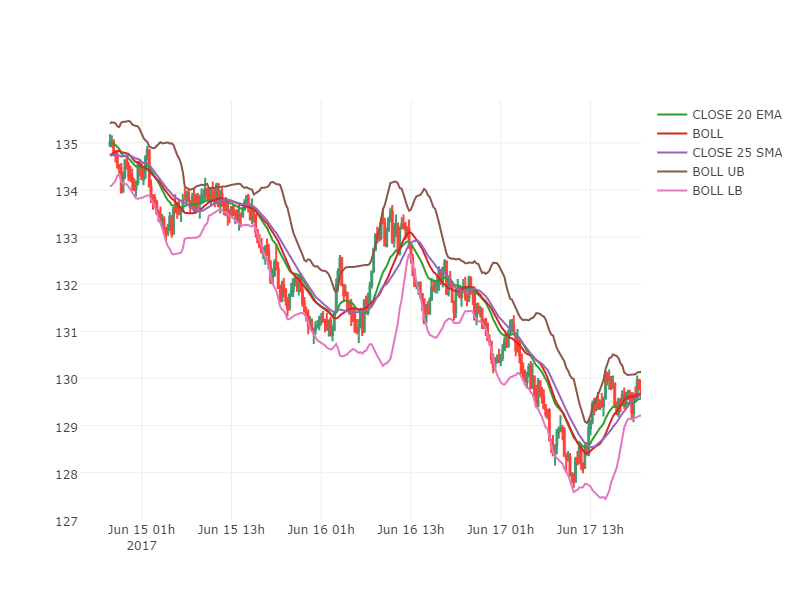

`high_20_max`, `low_20_min`だけがグラフから削除されました。

`pop`メソッドは以下の手順で進みます。

1. `self._indicator`の中からindicatorで指定された値を削除します。
2. `self.stock_dataframe`から`open, high, low, close`だけ抜き出します。
3. `self._indicators`に残っている指標を再度プロットします。

```python
    def pop(self, indicator):
        popper = self._indicators.pop(indicator)  # (1)
        self.stock_dataframe = reset_dataframe(self.stock_dataframe)  # (2)
        for reindicator in self._indicators.keys():
            self.stock_dataframe.get(reindicator)  # (3)
        return popper
```

`self.stock_dataframe`に入っている指標は、追加した指標によっては補助的に作られたカラムなどが混在します。
そのため、「ある指標によって作られたカラムだけ」を特定し、`self.stock_dataframe`から削除するのが困難です。
よって、一度`self.stock_dataframe`を`resample`がかかった状態まで戻し(2)、再度指標を追加しています(3)。

(3)は`append`メソッドとほとんど同じことですが、`self._indicators`に追加しません。
(1)の段階で`self._indicators`からは余計な指標を取り除いていないため、`self._indicators`に再度追加する必要がありません。

### 指標の初期化

追加した指標をすべて消すときは`clear`メソッドを使います。


```python
fx.clear()
fx.stock_dataframe.head()
```


<div>
<table border="1" class="dataframe">
  <thead>
    <tr style="text-align: right;">
      <th></th>
      <th>open</th>
      <th>high</th>
      <th>low</th>
      <th>close</th>
    </tr>
  </thead>
  <tbody>
    <tr>
      <th>2017-03-20 00:00:00</th>
      <td>115.00</td>
      <td>115.26</td>
      <td>114.87</td>
      <td>115.11</td>
    </tr>
    <tr>
      <th>2017-03-20 00:15:00</th>
      <td>115.11</td>
      <td>115.21</td>
      <td>114.85</td>
      <td>115.01</td>
    </tr>
    <tr>
      <th>2017-03-20 00:30:00</th>
      <td>115.01</td>
      <td>115.49</td>
      <td>114.90</td>
      <td>115.47</td>
    </tr>
    <tr>
      <th>2017-03-20 00:45:00</th>
      <td>115.47</td>
      <td>115.50</td>
      <td>115.24</td>
      <td>115.26</td>
    </tr>
    <tr>
      <th>2017-03-20 01:00:00</th>
      <td>115.25</td>
      <td>115.49</td>
      <td>115.10</td>
      <td>115.27</td>
    </tr>
  </tbody>
</table>
</div>


```python
fx.plot(start_view='first', end_view='last')
fx.show('png', filebasename='png6')
```


* データフレーム(`self.stock_dataframe`)を初期化します。
* グラフ(`self._fig`)を初期化します。
* 指標(`self._indicators`)を初期化します。
* **時間足は初期化しません。**
> hardオプションをTrueにする(`fx.clear(hard=True)`として実行する)ことで時間足も初期化できます(ハードリセット)。
> `self.stock_dataframe`は`None`に戻ります。
> ハードリセットをかけた後に再度プロットしたいときは`resample`メソッドから実行してください。

```python
    def clear(self, hard=False):
        self._fig = None  # <-- plotly.graph_objs
        self._indicators = {}
        if hard:
            self.stock_dataframe = None
            self.freq = None  # 足の時間幅
        else:
            self.stock_dataframe = reset_dataframe(self.stock_dataframe)
```

`clear`メソッドはほとんど`__init__`メソッドと同じですが、

* データとしての引数が必要ないこと
* デフォルトでは時間足を変更しないこと

> すなわち再度プロットするときに`resample`メソッドを使う必要がないこと

の点が`__init__`と異なります。

## まとめと補足

### 使用メソッドフローチャート
各メソッドの使用順序は以下に示すフローチャートの通りです。
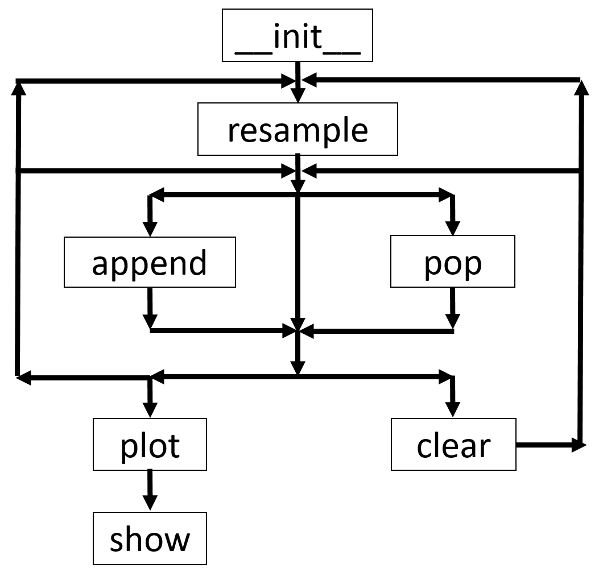

左側が追加と表示、右側が削除とリセットを表しています。

### ボリンジャーバンドについて

`stockstats`ではボリンジャーバンドで使う移動区間と$\sigma$がクラス変数として定義されています。

```
BOLL_PERIOD = 20
BOLL_STD_TIMES = 2
```

ここで移動区間を5, $\sigma$を1に変更してみます。


```python
sp.ss.StockDataFrame.BOLL_PERIOD = 5  # ボリンジャーバンド移動区間の設定
sp.ss.StockDataFrame.BOLL_STD_TIMES = 1  # ボリンジャーバンドσの設定
boll = sp.StockPlot(df)
boll.resample('4H')
boll.append('boll')  # ボリンジャーバンド真ん中(close_5_smaと同じ)
boll.append('boll_ub')  # ボリンジャーバンド上
boll.append('boll_lb')  # ボリンジャーバンド下
boll.plot(start_view='first', end_view='last')
boll.show('png', filebasename='png7')
```


$\sigma_1$と$\sigma_2$は同時に描けないのが残念です。

`BOLL_PERIOD`, `BOLL_STD_TIMES`は`stockstats`のクラス変数なので、
`stockplot.stockstats.BOLL_STD_TIMES = 2`のようにして再定義する必要があります。

しかし、`stockstats`が指標を追加するとき、`_get`メソッドを使うので、一度追加した指標が上書きされてしまいます。

グラフに描くだけであれば何とかすればできそうですが、今後の課題とします。

### サブチャートについて

[`stockstats`](https://github.com/jealous/stockstats)は多くの指標の出力に対応していますが、サブチャートを必要とする指標が多くあります。(MACD, RSI, ADX...)
今回のリリースではサブチャートに手を付けていません。
[Cufflinks](https://github.com/santosjorge/cufflinks)を使ってみたらサブプロットととかも簡単にいきそうな気がします。

### トップのgifファイルについて

最初のgif画像はチャートをipython上からインタラクティブにhtmlとして出力している様子です。

* モジュールのインポートから日足に変更するところまでを実行する`./test/stockplot_quickset.py`を実行します。
* 'close_25_sma'を追加します。
* 時間足を15分足に変えます。
* 'close_75_sma'を追加します。

```python
# ----------General Module----------
import numpy as np
import pandas as pd
# ----------User Module----------
from randomwalk import randomwalk
import stockplot as sp
# ----------Plotly Module----------
import plotly.offline as pyo
pyo.init_notebook_mode(connected=True)

# Make sample data
np.random.seed(1)
# 90日分の1秒tickを1分足に直す
df = randomwalk(60 * 60 * 24 * 90, freq='S', tick=0.01, start=pd.datetime(2017, 3, 20)).resample('T').ohlc() + 115

# Convert StockDataFrame as StockPlot
fx = sp.StockPlot(df)

# Resample as Day OHLC
fx.resample('D')
```


---
## 追記

__2017/4/21__
Qiitaに投稿しました。README.mdと内容はほぼ同じです。
[Plotlyでぐりぐり動かせる為替チャートを作る](http://qiita.com/u1and0/items/e2273bd8e03c670be45a)


__2017/4/22__
Qiitaデイリーランキング4位に入りました。ありがとうございます^^
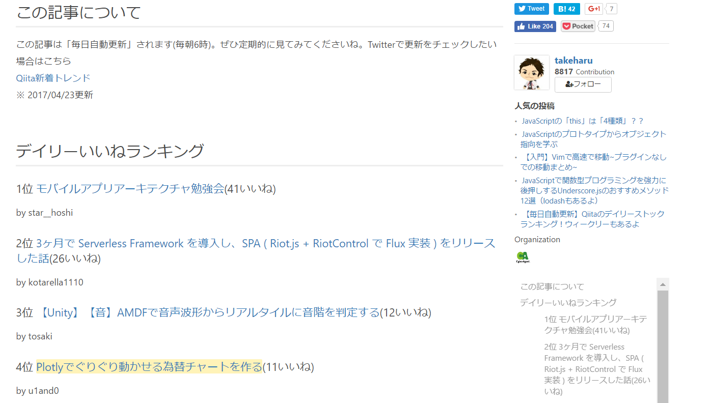


# read_hst.py


## 何をするためのスクリプト？
ヒストリカルデータをpythonを使用してpandas DataFrameとして読み出したり、csvやpickleに書き込みを行います。


## インストール
[github - u1and0/stockplot](https://github.com/u1and0/stockplot.git)からcloneしてください。

```shell-session
git clone https://github.com/u1and0/stockplot.git
```

binディレクトリ下のread_hst.pyを使用してください。
その他のファイルは次のページで説明しています。

* [pythonでローソク足(candle chart)の描画](https://qiita.com/u1and0/items/1d9afdb7216c3d2320ef)
* [plotlyでキャンドルチャートプロット](https://qiita.com/u1and0/items/0ebcf097a1d61c636eb9)
* [Plotlyでぐりぐり動かせる為替チャートを作る(1)](https://qiita.com/u1and0/items/e2273bd8e03c670be45a)
* [Plotlyでぐりぐり動かせる為替チャートを作る(2)](https://qiita.com/u1and0/items/b6e1cfba55778d505e7d)


## データのダウンロード
[FXDD Trading](http://www.fxdd.com/bm/jp/forex-resources/forex-trading-tools/metatrader-1-minute-data/) などからヒストリカルデータ(一分足のティックデータ)の圧縮ファイルをダウンロードしてください。

wget, aria2などのコマンドが使える環境にあれば

```
$ wget http://tools.fxdd.com/tools/M1Data/USDJPY.zip
```

などとしてヒストリカルデータの圧縮ファイルをダウンロードできます。 容量は50MB程度です。


## 使用方法

### jupyter notebook や ipython上で使うとき

1. read_hstモジュールをインポートします。
2. read_hst()関数にダウンロードしたzipファイルのパス、または解凍したhstファイルのパスを入れます。
3. 結果はpandas DataFrameとして返されます。

```python
import read_hst as h
df = h.read_hst('data/USDJPY.zip')  # zipファイルの相対/絶対パス
# hstファイル以外の拡張子が与えられると、展開したhstファイルは削除されます。

df = h.read_hst('data/USDJPY.hst')  # hstファイルの相対/絶対パス
# zipを解凍してhstファイルを引数に与えたらファイルを削除しません。

df.tail

                        open     high      low    close  volume
time
2017-11-17 08:32:00  112.573  112.584  112.573  112.581    50.0
2017-11-17 08:33:00  112.581  112.583  112.578  112.580    38.0
2017-11-17 08:34:00  112.580  112.583  112.578  112.580    51.0
2017-11-17 08:35:00  112.580  112.580  112.572  112.572    44.0
2017-11-17 08:36:00  112.572  112.574  112.572  112.572    24.0
```

### bashなどのshell上で使うとき
以下のコマンドは~/Data/USDJPY.zipを~/Data/USDJPY.csvとして保存します。
`-p`とすればpickleファイル(拡張子はpkl)としても保存できます。

```shell-session
$ cd ~/python/stockplot
$ bin/read_hst.py -c ~/Data/USDJPY.zip  # Convert .hst to .csv
$ bin/read_hst.py -h

usage: bin/read_hst.py [-h] [-c] [-p] filenames [filenames ...]

Convering historical file (.hst) to csv or pickle file.

positional arguments:
  filenames

optional arguments:
  -h, --help    show this help message and exit
  -c, --csv     Convert to csv file
  -p, --pickle  Convert to pickle file
```

## 参考
* numpyを使用して高速にバイナリ→テキスト変換 >> [(´・ω・｀；)ﾋｨｨｯ　すいません - pythonでMT4のヒストリファイルを読み込む](http://fatbald.seesaa.net/article/447016624.html)
* 引数読み込み >> [Converting MT4 binary history files: hst to csv using a python script](http://mechanicalforex.com/2015/12/converting-mt4-binary-history-files-hst-to-csv-using-a-python-script.html)