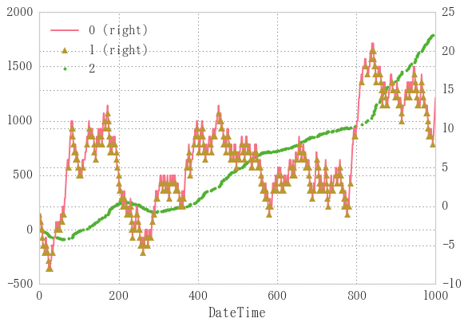
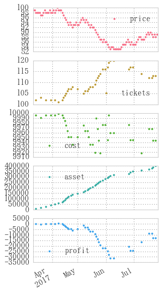
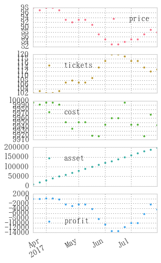

# ドルコスト平均法
1. 下がったら買い
2. 一定数ではなく、一定額を買う
> 値段が下がればいっぱい買える。
> 値段が上がれば控えめに買っておく

## ランダムウォークのシリーズを作成


```python
n = 1000
bullbear = pd.Series(np.random.randint(-1, 2, n))
price = bullbear.cumsum()
price.index.name='DateTime'
price.plot()
```


    <matplotlib.axes._subplots.AxesSubplot at 0x1c0dc30efd0>


# 前日より値が低かったら買い、高かったら見過ごし
ドルコスト平均法の(1)


```python
position = np.zeros(len(price))  # priceと同じ長さの配列を作成
for i in price.index[:-1]:
    if price[i+1] - price[i] < 0:  # 前日の値のほうが小さければ高ければ安くなっているということ
        position[i]=price[i]  # そのときのpriceで買い
position[:60]
```


    array([ 0.,  0.,  0., -1., -2.,  0., -2., -3., -4.,  0.,  0.,  0., -5.,
            0.,  0.,  0.,  0., -4., -5.,  0., -5.,  0., -6., -7.,  0.,  0.,
           -7.,  0.,  0.,  0.,  0.,  0., -5.,  0.,  0.,  0.,  0.,  0.,  0.,
            0.,  0.,  0., -2.,  0.,  0., -2.,  0.,  0., -2.,  0., -2.,  0.,
            0.,  0., -1.,  0., -1.,  0.,  0.,  0.])


```python
fig, ax = plt.subplots()
price.plot(ax=ax)
pd.DataFrame(position).cumsum().plot(ax=ax, secondary_y=True)  # ポジションのcumulative sumをプロット
```


    <matplotlib.axes._subplots.AxesSubplot at 0x1c0dc3f4c88>


## priceからbullbearの計算
priceはbullbearから発生させているが、
実際の日経平均などからはpriceをネット上 のデータとして引っ張ってくるので、 
priceの値からbullbearを計算できるようにする


```python
def p2b(price):
    return price.sub(price.shift(1), fill_value=0)
```


```python
np.array_equal(p2b(price), np.array(bullbear))
```


    True


`p2b`関数によってbullbearの計算が可能となった。

## 効率化
前日の値より低かった日の終値だけを収集する関数


```python
def dob(price):
    pos = np.zeros(len(price))  # priceと同じ長さの配列を作成
    for i in price.index[:-1]:
        if price[i+1]<price[i]:  # 前日の値より安ければ
            pos[i]=price[i]  # 買い
    return pos
```


```python
%timeit dob(price)
```

    10 loops, best of 3: 26.3 ms per loop
    

最もシンプル


```python
%timeit [price[i] if price[i+1]<price[i] else 0 for i in price.index[:-1]]
```

    10 loops, best of 3: 39.8 ms per loop
    

内包表記を用いても時間はあまり変わらない


```python
def dob2(price):
    pos = np.zeros(len(price))  # priceと同じ長さの配列を作成
    pos = [price[i] if price.sub(price.shift(1), fill_value=0)<0 else 0]  # 下がったら買い
    return pos
```


```python
price[np.array(bullbear)<0]  # bullbearが負の値になったところだけのpriceを収集
```


    DateTime
    0      -1
    4      -2
    5      -3
    7      -3
    8      -4
    9      -5
    13     -6
    18     -5
    19     -6
    21     -6
    23     -7
    24     -8
    27     -8
    33     -6
    43     -3
    46     -3
    49     -3
    51     -3
    55     -2
    57     -2
    60     -1
    62     -1
    74      5
    82     10
    84     10
    85      9
    86      8
    88      7
    92      7
    93      6
           ..
    908    13
    912    13
    913    12
    914    11
    925    14
    929    15
    932    15
    933    14
    939    15
    947    17
    948    16
    949    15
    952    15
    953    14
    954    13
    957    13
    965    16
    966    15
    969    14
    970    13
    972    13
    976    12
    979    12
    980    11
    981    10
    982     9
    984     9
    986     9
    989     9
    992     8
    dtype: int32


```python
def lowprice(price):
    """bullbearが負になったところだけのpriceを収集したpd.Seriesを返す"""
    return price[np.array(p2b(price))<0]
```


```python
%timeit lowprice(price)
```

    100 loops, best of 3: 3.27 ms per loop
    

pd.Serieesから直接引き出すので高速。10倍速を実現した

## 可視化
価格(price)と購入した時の額(low)と合計資産(asset)を描画する


```python
low = lowprice(price)
ax = pd.DataFrame([price, low, low.cumsum()]).T.plot(grid=True, style=['-', '^', '.'], secondary_y=[False, False, True])
```





```python
low = lowprice(price)
df = pd.DataFrame([price, pd.Series(np.zeros_like(low)+min(price), index=low.index), low.cumsum()]).T
df.plot(grid=True, style=['-', '^', '.'], secondary_y=[False, False, True])
```


    <matplotlib.axes._subplots.AxesSubplot at 0x1c0dc5d86d8>


# 一定金額を買い
ドルコスト平均法の(2)

## ランダムウォークの関数化


```python
def randomwalk(periods, start=pd.datetime.today().date(), name=None):
    """periods日分だけランダムウォークを返す"""
    ts = pd.date_range(start=start, periods=periods, freq='B')
    bullbear = pd.Series(np.random.randint(-1, 2, periods), index=ts, name=name)
    price = bullbear.cumsum()
    return price
price=randomwalk(100) + 100  # 100は初期値
price.plot()
```


    <matplotlib.axes._subplots.AxesSubplot at 0x1c0dc65f128>


## 枚数(ticket)の購入

ランダムウォークによる価格変動を再定義。
関数化してみた。

* 縦軸が単位[円]だとする
* 例えば10000円(unit_cost)ずつ買っていくとする
* ~~口数(ticket)の最小口数は1000円~~


```python
unit_cost = 10000
# min_cost = 1000
ticket = unit_cost / price[0]
ticket, int(ticket)
```


    (101.01010101010101, 101)


0インデックス目


```python
tickets = unit_cost / price
pd.DataFrame([price, tickets, tickets.astype(int)],
             index=['price', 'ticket(float)', 'ticket(int)']).T.head()
```


<div>
<table border="1" class="dataframe">
  <thead>
    <tr style="text-align: right;">
      <th></th>
      <th>price</th>
      <th>ticket(float)</th>
      <th>ticket(int)</th>
    </tr>
  </thead>
  <tbody>
    <tr>
      <th>2017-03-13</th>
      <td>99.0</td>
      <td>101.010101</td>
      <td>101.0</td>
    </tr>
    <tr>
      <th>2017-03-14</th>
      <td>99.0</td>
      <td>101.010101</td>
      <td>101.0</td>
    </tr>
    <tr>
      <th>2017-03-15</th>
      <td>98.0</td>
      <td>102.040816</td>
      <td>102.0</td>
    </tr>
    <tr>
      <th>2017-03-16</th>
      <td>98.0</td>
      <td>102.040816</td>
      <td>102.0</td>
    </tr>
    <tr>
      <th>2017-03-17</th>
      <td>98.0</td>
      <td>102.040816</td>
      <td>102.0</td>
    </tr>
  </tbody>
</table>
</div>


全期間に適用。

切り捨てすると時は`astype(int)`メソッドを使う。

## 一定額ずつ購入していったあとの資産の計算


```python
def dollcost(lowprice, unit_cost):
    """一定額ずつの購入
    引数: 
        price: 購入したときの価格と日付のSeries
        unit_cost: 購入するときの一定金額
    戻り値:
        tickets: 購入したチケット数
    """
    tickets = unit_cost / lowprice
    return tickets.astype(int)
```


```python
# lowprice関数: 前日より価格が低い時に買いを行った時の時間と価格のSeries返す
# dollcost関数: 一定額ずつの購入
tickets = dollcost(lowprice(price), 10000)
cost = tickets * price
asset = cost.cumsum()
profit = tickets.cumsum() * price - asset

df = pd.DataFrame([price, tickets, cost, asset, profit],
                  index=['price', 'tickets', 'cost', 'asset', 'profit']).T
print(df.head())
df.plot(style='.', subplots=True, figsize=(4,9))
```

                price  tickets    cost   asset  profit
    2017-03-13   99.0      NaN     NaN     NaN     NaN
    2017-03-14   99.0      NaN     NaN     NaN     NaN
    2017-03-15   98.0    102.0  9996.0  9996.0     0.0
    2017-03-16   98.0      NaN     NaN     NaN     NaN
    2017-03-17   98.0      NaN     NaN     NaN     NaN
    


    array([<matplotlib.axes._subplots.AxesSubplot object at 0x000001C0DC634630>,
           <matplotlib.axes._subplots.AxesSubplot object at 0x000001C0DDA66898>,
           <matplotlib.axes._subplots.AxesSubplot object at 0x000001C0DDAAE208>,
           <matplotlib.axes._subplots.AxesSubplot object at 0x000001C0DDAFD748>,
           <matplotlib.axes._subplots.AxesSubplot object at 0x000001C0DDB44860>], dtype=object)





```python
price[-1] * tickets.sum() - cost.sum()  # 最終損益
```


    -8561.0


## 特定期間で買い
毎週毎週購入かけているとお金が大量に必要になってしまう。
そんなに大量のお給料をもらっていないのである程度制限する。
ある週に1回でも購入したら、その週は条件が来ても購入を控えようと思う。

仮に、理想的に毎週の底値で購入できたとする


```python
lowweek = price.resample('W').min()
lowweek[:10]
```


    2017-03-19    98
    2017-03-26    97
    2017-04-02    98
    2017-04-09    98
    2017-04-16    97
    2017-04-23    93
    2017-04-30    92
    2017-05-07    93
    2017-05-14    93
    2017-05-21    91
    Freq: W-SUN, dtype: int32


## ticket, cost, assetの計算関数


```python
def profitcalc(price, unit_cost): 
    """購入した価格からプロフィットカーブを計算する
        引数:
            price: 購入価格と日付のSeries
            unit_cost: 購入一定額
        戻り値: price, tickets, cost, asset, profitを入れたdataframe"""
    tickets = dollcost(price, unit_cost)  # dollcost関数: 一定額ずつの購入
    cost = tickets * price
    asset = cost.cumsum()
    profit = tickets.cumsum() * price - asset
    df = pd.DataFrame([price, tickets, cost, asset, profit],
            index=['price', 'tickets', 'cost', 'asset', 'profit']).T
    print('Final Asset: %d'% df.asset[-1])
    print('Final Profit: %d'% df.profit[-1])
    return df
```


```python
df = profitcalc(lowweek, 10000)
df.head(10)
df.plot(subplots=True, style='.', figsize=[4,8])
```


    array([<matplotlib.axes._subplots.AxesSubplot object at 0x000001C0DDCED908>,
           <matplotlib.axes._subplots.AxesSubplot object at 0x000001C0DF1C8F98>,
           <matplotlib.axes._subplots.AxesSubplot object at 0x000001C0DF03C198>,
           <matplotlib.axes._subplots.AxesSubplot object at 0x000001C0DF07AA58>,
           <matplotlib.axes._subplots.AxesSubplot object at 0x000001C0DF0D04A8>], dtype=object)





```python
df.profit[-1]  # 最終損益
```


    -4433


## 別のランダムウォークで計算


```python
pr = randomwalk(1000) + 100
df = profitcalc(pr.resample('W').min(), unit_cost=10000)
# df.plot(subplots=True, style='.', figsize=[4,8])
df.ix[:, ['price', 'profit']].plot(secondary_y=['profit'])
```

    Final Asset: 1993341
    Final Profit: -609801
    


    <matplotlib.axes._subplots.AxesSubplot at 0x1c0e7022f28>


# 開発中


```python
pd.Period('20170312', 'W')
```


    Period('2017-03-06/2017-03-12', 'W-SUN')


一定期間としてみなすようにコンバートするにはpandas.Periodクラスを使う。

2017/3/12は2017-03-06/2017-03-12の週の間に存在することがわかる。


```python
ts = pd.date_range('20170312', periods=100)
df = pd.DataFrame(np.random.rand(len(ts)), index=ts)
ps = df.asfreq('W', how='end')
ps.head()
```


<div>
<table border="1" class="dataframe">
  <thead>
    <tr style="text-align: right;">
      <th></th>
      <th>0</th>
    </tr>
  </thead>
  <tbody>
    <tr>
      <th>2017-03-12</th>
      <td>0.154647</td>
    </tr>
    <tr>
      <th>2017-03-19</th>
      <td>0.872252</td>
    </tr>
    <tr>
      <th>2017-03-26</th>
      <td>0.056396</td>
    </tr>
    <tr>
      <th>2017-04-02</th>
      <td>0.895192</td>
    </tr>
    <tr>
      <th>2017-04-09</th>
      <td>0.888789</td>
    </tr>
  </tbody>
</table>
</div>


週の最後の日の見つけ方がわかった

whileでこの日まで回して、購入行動を行ったらbreakでwhileから抜けるようにする。


```python
def lowprice(price):
    """bullbearが負になったところだけのpriceを収集したpd.Seriesを返す
    ただし、1度購入すると次の週になるまで購入できない"""
    pos = np.zeros_like(price)
    for end in price.index.asfreq('W', how='end'):
        for i in date_range():
            for i in price.index[:-1]:
                if price[i+1] - price[i] < 0:  # 前日の値のほうが小さければ高ければ安くなっているということ
                    position[i]=price[i]  # そのときのpriceで買い
    return price[np.array(p2b(price))<0]
```


```python
[i for i in price.index.asfreq('W', )]
```


    ---------------------------------------------------------------------------

    AttributeError                            Traceback (most recent call last)

    <ipython-input-45-e769980cb68f> in <module>()
    ----> 1 [i for i in price.index.asfreq('W', )]
    

    AttributeError: 'DatetimeIndex' object has no attribute 'asfreq'


```python
p = pd.Period('20170312', 'W')
p.week
```


```python

```
